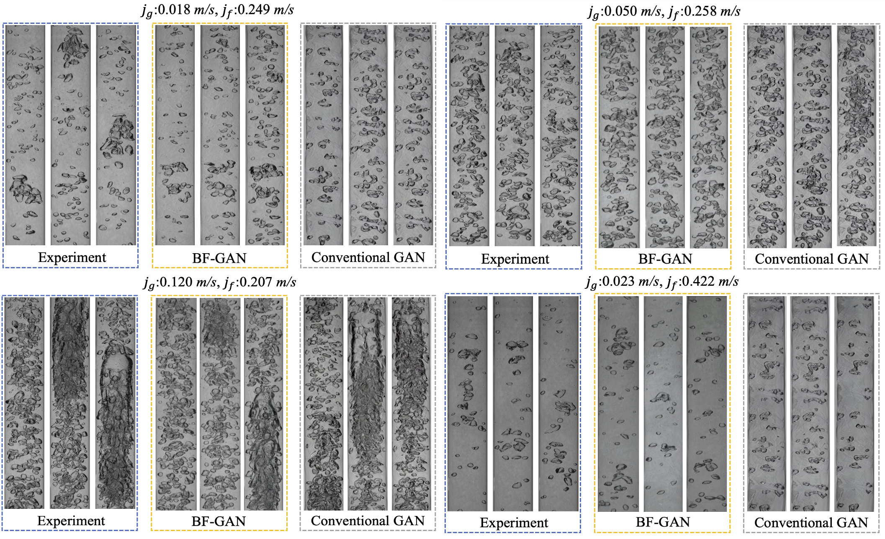
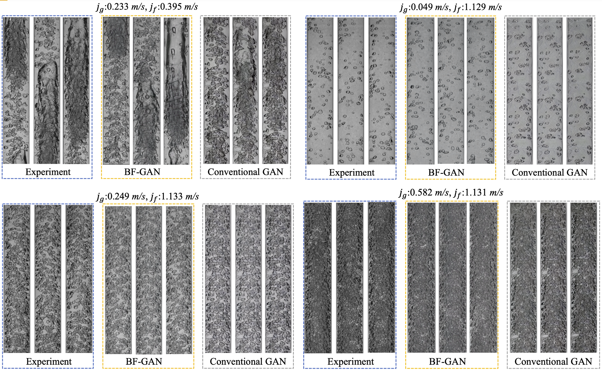
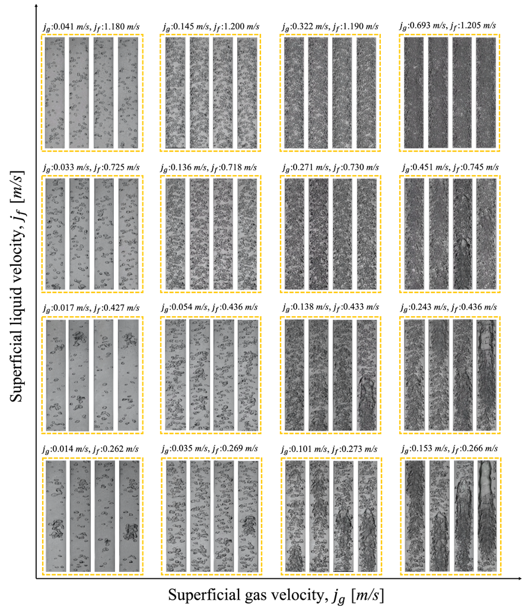
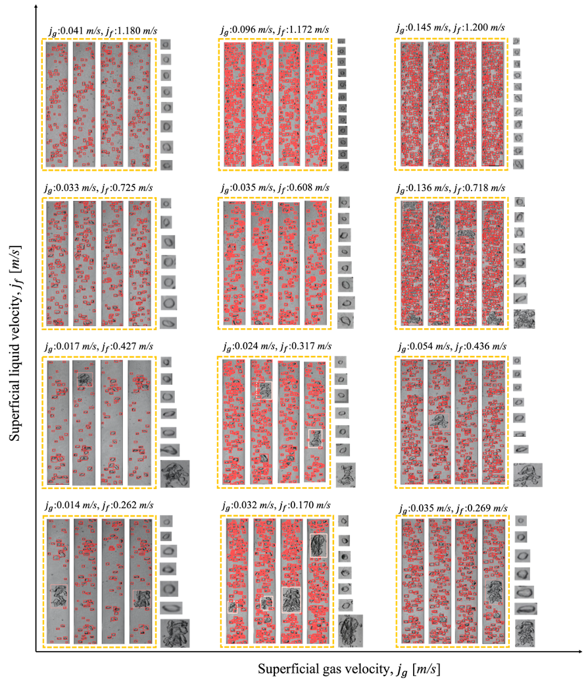
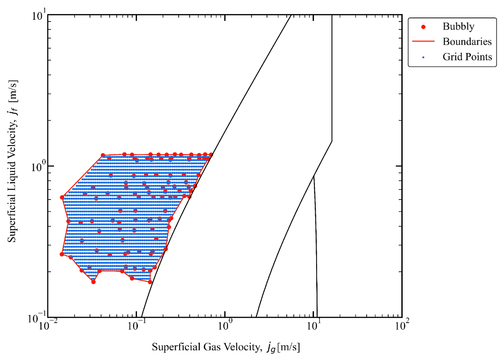

## BF-GAN: Development of an AI-driven Bubbly Flow Image Generation Model Using Bubbly Generative Adversarial Networks<br><sub>Official PyTorch implementation version</sub>




**BF-GAN**<br>
Wen Zhou1, Shuichiro Miwa1, Yang Liu2, Koji Okamoto1<br>
1Department of Nuclear Engineering and Management, School of Engineering, The University of Tokyo, 7-3-1 Hongo, Bunkyo-ku, Tokyo 113-8654, Japan<br>
2 Mechanical Engineering Department, Virginia Tech, Blacksburg, VA 24061, USA<br>
<br>

Abstract: In recent years, image processing methods for bubbly flow, including conventional computer vision techniques, bubble detection, segmentation, and tracking algorithms, have seen significant development due to their high efficiency and accuracy. However, acquiring large volumes of high-quality bubbly flow images remains both time-consuming and costly endeavor. To address this issue, a generative AI architecture called bubbly flow generative adversarial networks (BF-GAN) is developed, designed to generate realistic and high-quality bubbly flow images through physically conditioned inputs, j_g and j_f.<br>

Initially, 105 sets of bubbly flow experiments under varying conditions are conducted to collect 278,000 bubbly flow images with physical labels of j_g and j_f for training data. A multi-scale loss function of GAN is then developed, incorporating mismatch loss and feature loss to enhance the generative performance of BF-GAN further.<br>

Regarding evaluative metrics of generative AI, the BF-GAN has surpassed conventional GAN, marking a quantitative benchmark have been established in the bubbly flow domain for the first time. In terms of image correspondence, BF-GAN and the experimental images exhibit good agreement. Physically, key parameters of bubbly flow generated by BF-GAN, such as void fraction, aspect ratio, Sauter mean diameter, and interfacial area concentration, are extracted and compared with measurement values and empirical correlations, validating BF-GAN's generative performance within 10% error. The comparative analysis demonstrate that the BF-GAN can generate realistic and high-quality bubbly flow images with any given j_g and j_f within the research scope, and these images align with physical properties. BF-GAN provides a generative AI tool for two-phase flow studies, significantly reducing the time and cost of acquiring high-quality data. It can also serve as a benchmark dataset for bubbly flow detection and segmentation algorithms, improving further productivity in this field.<br>___________


Keywords: 
Bubbly Flow; Physically Conditioned Deep Learning; Image Generation Model; Generative Adversarial Networks<br>


## Requirements

* Linux and Windows are supported, but we recommend Linux for performance and compatibility reasons.
* NVIDIA GPUs with at least 4 GB of memory. We have done all testing and development using RTX A6000 and A6000 ADA GPUs.
* 64-bit Python 3.9 and PyTorch 2.3.1 were utilized in the present study. See https://pytorch.org for PyTorch install instructions.
* CUDA toolkit 11.1 or later.  (Why is a separate CUDA toolkit installation required?  See [Troubleshooting](./docs/troubleshooting.md#why-is-cuda-toolkit-installation-necessary)).
* GCC 7 or later (Linux) or Visual Studio (Windows) compilers.  Recommended GCC version depends on CUDA version, see for example [CUDA 11.4 system requirements](https://docs.nvidia.com/cuda/archive/11.4.1/cuda-installation-guide-linux/index.html#system-requirements).
* In the present study,  nvcc -V: Cuda compilation tools, release 11.6, V11.6.112;  NVIDIA-SMI 550.90.07; Driver Version: 550.90.07;  CUDA Version: 12.4

* Python libraries: see [environment.yml](./environment.yml) for exact library dependencies.  You can use the following commands with Miniconda3 to create and activate your StyleGAN3 Python environment:
  - `conda env create -f environment.yml`
  - `conda activate BF-GAN`

## Getting started (BF-GAN)

* Pre-trained BF-GAN models are stored as `*.pkl` files at ./BF-GAN-models/ <br>

* More models means more diversity.

* You can download the BF-GAN models at：https://data.mendeley.com/datasets/gtbcrhdnrh/1

```.bash
# Generate an bubbly flow image using pre-trained models

python BF-GAN.py --outdir=out --label=0.014,0.260 --seeds=0-33 --network=/home/user/ZHOU-Wen/BF-GAN/BF-GAN-models/network-snapshot-00027-5000.pkl
```

'outdir' will specify the output directory.

'label' refers to the value of jg and jf in m/s. Note that the values of jg and jf are separated by commas and there are no spaces.

'seeds' are used to reproduce the same input. One seed will generate 5 images. List of random seeds (e.g., \'0,1,4-6\')

'network' specifies the model location.




## Getting started (Bubble detection)
Pre-trained Bubble detection model is stored as `*.pt` files at ./Bubble_detection_model/weights/.

The current bubble detection model is completely based on the BF-GAN dataset, so their combination is the best. This can be used to detect bubbles and further extract their properties.

The bubble detection model is based on YOLOv5. For the installation of YOLOv5, please see: https://github.com/ultralytics/yolov5 <br>
The detect.py script of YOLOv5 was utilized in the present study.

You can download the Bubble detection models at：https://data.mendeley.com/datasets/9f88nrbz4s/1


```.bash
# Detect an bubbly flow image

python detect.py --source "./images" --weight best.pt --imgsz=1024 --save-txt --save-crop --line-thickness=2 --hide-labels --hide-conf

```




## Pre-generative bubbly flow images

To facilitate everyone to reduce the cost of use. <br>
According to the distribution of the current dataset, a red boundary is drawn. By increasing the number of points by 5% (blue points), a total of 2,000 bubble points are obtained. Each point is generated by 3,000 images from six BF-GAN models. Therefore, a dataset consisting of 6 million bubbly flow images is generated, corresponding to the jg and jf conditions of the blue points.


## Citation

```
2024
BF-GAN: Development of an AI-driven Bubbly Flow Image Generation Model Using Bubbly Generative Adversarial Networks
Wen Zhou1, Shuichiro Miwa1, Yang Liu2, Koji Okamoto1
```

